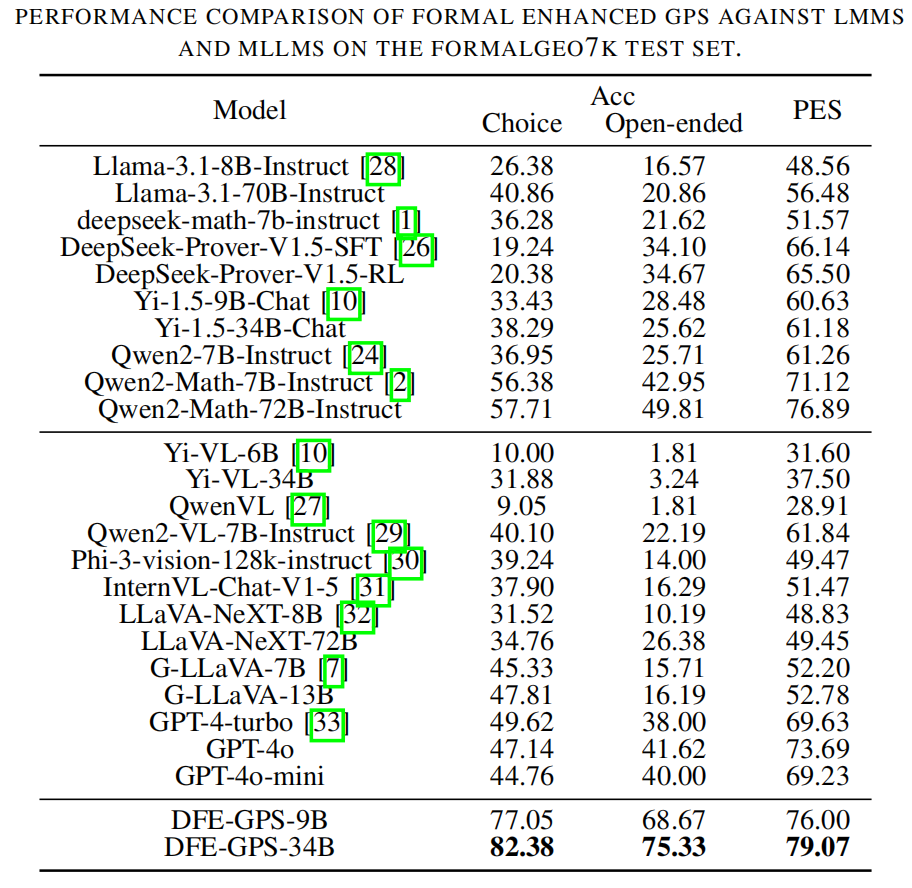

# Diagram Formalization Enhanced Multi-Modal Geometry Problem Solver
**Dataset**: 🤗 [SynthGeo-228k](https://huggingface.co/datasets/JO-KU/SynthGeo228K) | **Diagram Formalizer**: 🤗 [Diagram Formalizer](https://huggingface.co/NaughtyDog97/DiagramFormalizer) | **Reasoning Model**: 🤗 [DFE-GPS-9B](https://huggingface.co/NaughtyDog97/DFE-GPS-9B) | 🤗 [DFE-GPS-34B](https://huggingface.co/NaughtyDog97/DFE-GPS-34B)

  

In this study, we introduce the Diagram Formalization Enhanced Geometry Problem Solver (DFE-GPS), a multi-modal architecture with three core components: a Diagram Formalizer, a Projection module, and a LLM. The LLM processes three types of inputs: diagram features $\mathcal{F}_{D}$ from the Diagram Encoder, formal diagram language representations (ConsCDL and ImgCDL) from the Diagram Formalizer, and natural language inputs containing problem statements and instructions. The Projection module aligns this information in the LLM's semantic space, enabling effective fusion. The LLM then refines the formal representations and generates reasoning steps for problem-solving. We used pre-trained [SigLIP-0.4B]() as the Vision Encoder, [Qwen2-0.5B-Instruct]() as the Lightweight LLM, and [Yi-1.5-Chat]() (9B or 34B) as the primary LLM. The training process is divided into three stages, all of which focus on auto-regressive generation tasks.
- **Stage 1**: The first stage focuses on training the Diagram Formalizer module, with training objective of generating formalized language descriptions corresponding to geometric diagrams. During this stage, all parameters of the Vision Encoder and part of the parameters of the Lightweight LLM (via the LoRA) are trainable to enhance the ability to extract visual features.
- **Stage 2**: The second stage emphasizes training the Projection modules, aligning vision feature $\mathcal{F}_{D}$ with the semantic space of the LLM by generating natural language descriptions and formalized language expressions for the geometric diagrams. During training, the parameters of the Diagram Encoder and LLM are frozen, with only the MLP parameters connecting the visual features and the language model being trainable.
- **Stage 3**: In the third stage, instruction fine-tuning enables the model to calibrate formalized diagram representations and solve problems. The input consists of geometric diagrams, formalized descriptions with random perturbations simulating Diagram Formalizer errors, and problem text accompanied by calibration and reasoning directives. The model learns to refine ConsCDL and ImgCDL, generating coherent natural language reasoning. During this phase, the parameters of the Diagram Encoder remain fixed, while the MLP and LLM parameters are trainable. Full parameter tuning is applied to the 9B model, whereas LoRA tuning is employed for the 34B model.

## Peformance

  

